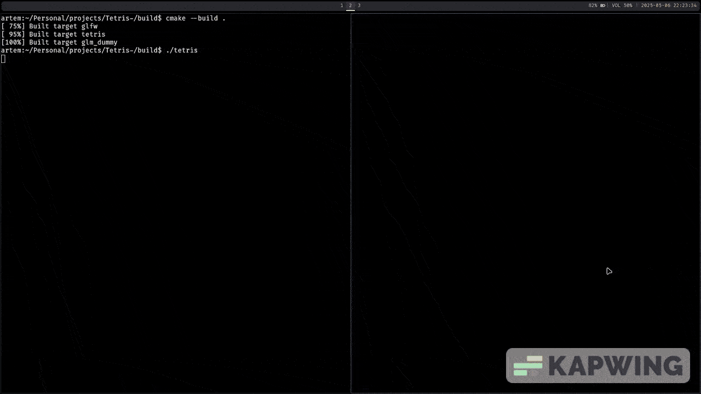

# Tetris++ -> Tetris Clone with C++ and OpenGL
Just a clon of tetris built in C++ with OpenGL to get a better understanding of how graphics work under the hood. This is my first real C++ project. 


The clip does not show the true colors of the pieces, because the video editing software I use made them almost gray and white


## Game Mechanics

The game mechanics are simple, like I said it is a tetris clon. Basically:

 - Pieces go down in an interval of time which depends on your score.
 - The pieces can rotate and move right, left, and down 
 - Moving down means you want to decrease the interval time between every time the piece automatically moves down.

- **Headers** and **src** files are organized in their respective folders.
- **Textures** and **music** files are placed in folders named after their categories (e.g., `tetris_music` inside the `music` folder).

All the textures were made by me and the music I took it from internet archive (here is a link-> https://archive.org/details/TetrisThemeMusic).

## How to run it?

I think it is possible to run it on other OS, but unfortunately it has only been tested on Linux OS since I only have a linux computer, but if anyone knows about the topic let me know in the issues section please.

### Steps to Run:

1. Make sure you have **CMake** installed.
2. Navigate to the `build` folder and run the following commands:

```bash
cmake ..             # Link the folder with the CMake file
cmake --build .      # Compile the source code into an executable called 'tetris' (without file extension)
./tetris             # Run the compiled executable


